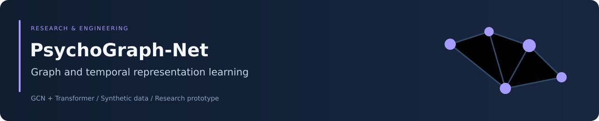
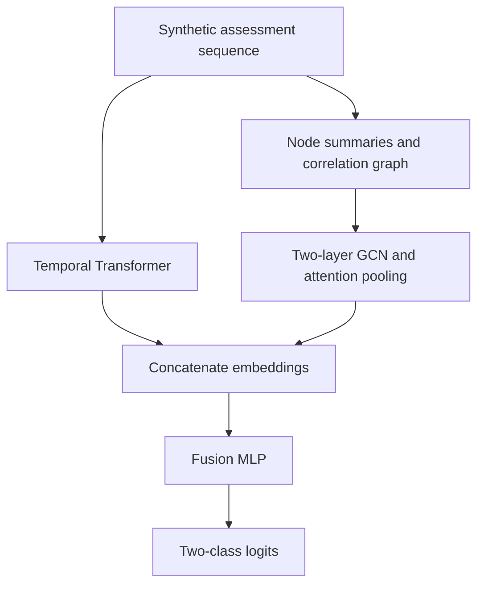

<div align="center">



# PsychoGraph-Net

### Graph and temporal representations for synthetic psychiatric modeling


[Overview](#overview) · [Architecture](#architecture) · [Data](#synthetic-task-and-inputs) · [Training](#installation-and-training) · [Interpretation](#explanation-method) · [Reproducibility](#reproducibility-and-research-boundaries)

</div>

## Overview

PsychoGraph-Net combines a symptom graph encoder with a temporal Transformer for a binary classification demonstration. LSTM and CNN baselines provide temporal-only comparisons.

The executable workflow generates synthetic patient-like sequences. **The labels and discriminative patterns are simulator-defined; held-out performance on this task is not evidence of clinically validated rapid-cycling prediction.** The repository does not include a real-patient cohort, prospective outcomes, or a validated clinical forecasting horizon.

| Component | Implemented role |
|---|---|
| Synthetic generator | Simulated assessments, labels, summary features, and correlation graphs |
| Graph stream | Two GCN layers with attention pooling |
| Temporal stream | Projected sequences, learned position embeddings, Transformer layers, mean pooling |
| Fusion head | Concatenated embeddings mapped to two logits |
| Baselines | LSTM and CNN models using temporal inputs |
| Training | Validation-F1 checkpoint selection and held-out test metrics |
| Explanation | Local temporal perturbation sensitivity |
| Neo4j loader | Separate data-access module; not connected to the training CLI |

## Architecture



The default graph and temporal embeddings each have dimension 64; the fusion head uses 128 → 64 → 32 → 2 layers.

Normalized adjacency is constructed as $\hat A=D^{-1/2}AD^{-1/2}$ with self-loops. Graph propagation applies a learned projection, LayerNorm, GELU, and dropout to $\hat A H$. The temporal encoder uses four attention heads, two layers, learned positional embeddings, and mean pooling.

See [the graph encoder](models/gnn.py), [temporal encoder](models/transformer.py), and [fusion model](models/psychograph_net.py) for exact operations.

## Synthetic task and inputs

The default generator creates 600 simulated patients, 12 assessment steps, and 15 named symptom features. Binary labels are drawn first; class-dependent cycles, shared latent factors, or low-amplitude drift are then injected into the sequences.

These names provide a psychiatric modeling context, but generated numerical values are not validated clinical-scale measurements. No observed episode-count outcome or future follow-up window is derived.

| Tensor | Default shape | Meaning |
|---|---|---|
| Temporal data | `[N, 12, 15]` | Assessment values by time and symptom |
| Node features | `[N, 15, 3]` | Per-symptom mean, standard deviation, and range |
| Adjacency | `[N, 15, 15]` | Symmetrically normalized graph |
| Labels | `[N]` | Simulator-defined class 0 or 1 |

Edges are based on absolute within-sequence Pearson correlation above 0.22. Both positive and negative correlations become unsigned edges. Graph features summarize the same sequence supplied to the Transformer.

## Installation and training

Use Python 3.10+ because the source uses modern union type syntax. Run commands from the repository root in an isolated environment.

```bash
git clone https://github.com/Foysal-A-Al/PsychoGraph-Net.git
cd PsychoGraph-Net
python -m venv .venv
```

Activate with `source .venv/bin/activate` on Linux/macOS or `.venv\Scripts\Activate.ps1` in Windows PowerShell:

```bash
python -m pip install -r requirements.txt
python train.py --model all
```

A shorter functional experiment can use:

```bash
python train.py --model pgn --epochs 5
```

Five epochs are a smoke-run choice, not a performance recommendation.

| CLI option | Default | Meaning |
|---|---|---|
| `--model` | `all` | `pgn`, `lstm`, `cnn`, or all three |
| `--epochs` | 100 | Training epochs |
| `--lr` | 0.0008 | AdamW learning rate |

Training splits patient indices into 70% training, 15% validation, and 15% test sets with stratification. The best checkpoint is selected by validation macro F1. The optimizer uses weight decay 0.0001, gradient clipping, and cosine annealing with warm restarts.

Current entry points leave models and tensors on CPU; automatic GPU selection is not implemented. The requirements file installs Neo4j and the external LIME package too, although the default synthetic workflow does not require either integration.

## Evaluation and outputs

Always pass a trained checkpoint when evaluating:

```bash
python evaluate.py --model pgn --ckpt results/checkpoints/pgn_best.pt
python evaluate.py --model lstm --ckpt results/checkpoints/lstm_best.pt
```

**Without `--ckpt`, evaluation uses random model weights.** It does not automatically load the best training checkpoint.

| Output | Contents |
|---|---|
| `results/checkpoints/pgn_best.pt` | PGN model state and selected validation F1 |
| `results/checkpoints/lstm_best.pt` | LSTM checkpoint when trained |
| `results/checkpoints/cnn_best.pt` | CNN checkpoint when trained |
| `results/test_results.json` | Training-entry-point test metrics for selected models |
| `results/lime_attribution.json` | PGN temporal perturbation results from evaluation |

Reported metrics are accuracy, macro precision, macro recall, macro F1, and ROC AUC. No fixed score is asserted here without a saved checkpoint, environment, and matching experiment configuration.

Training and evaluation regenerate data independently from `config.py`. Keep its data configuration unchanged between runs. Checkpoints do not save a full configuration or split manifest.

## Configuration and reproducibility

[config.py](config.py) defines data, model, training, and output settings. Data settings are read by the generator, while CLI epoch and learning-rate values override their training defaults.

Models are instantiated with their constructors' default arguments. Editing `CFG.model` alone does not wire those settings into model construction; changes require explicit constructor arguments and matching evaluation setup.

Data generation and splits use a fixed seed. The training entry point does not explicitly seed PyTorch initialization or DataLoader shuffling, so the configured seed does not guarantee identical trained weights.

Preserve the repository commit, exact dependencies, configuration, checkpoint, split identities, and metrics for any reported result. Current requirements specify lower bounds rather than a locked environment.

## Explanation method

The class named `LIMEExplainer` replaces one symptom's temporal sequence with Gaussian noise, measures the mean absolute change in target-class probability, and min–max normalizes these changes across symptoms.

It does **not** fit the weighted local surrogate used in standard LIME. A more precise interpretation is temporal perturbation sensitivity.

For PGN explanations, node features and adjacency remain unchanged while the temporal input is perturbed. Results therefore describe sensitivity through the temporal branch conditional on the original graph inputs, not a complete joint graph-and-time attribution or a causal effect.

## Neo4j integration

[data/neo4j_loader.py](data/neo4j_loader.py) reads patient labels and `seq_data_json`, then reconstructs features and graphs. Despite the illustrative relationship schema in its docstring, the implemented query does not load graph relationships from Neo4j.

The training CLI still calls the synthetic generator. Using Neo4j data requires explicit integration, input/label validation, and a documented missing-data policy. The loader zero-fills unprovided values; that behavior is not a validated clinical imputation strategy.

## Reproducibility and research boundaries

No automated test suite, CI workflow, saved trained checkpoints, or independently verified benchmark report is included in this checkout. Training and upstream database access were not verified in this README update.

Before drawing research conclusions, address repeated-seed variability, comparable model-input ablations, confidence intervals, calibration, subgroup behavior, outcome definitions, and external validation. Simulator-induced separability cannot establish clinical utility.

This software is a research prototype, not a diagnostic, treatment, or crisis-assessment tool.

## Attribution and licensing

Maintained by [Abdullah Al Foysal](https://github.com/Foysal-A-Al). The previous project description records collaboration with clinical researchers at the Istituto di Psicopatologia, Rome; that context does not substitute for validation of this synthetic demonstration.

Cite the repository and exact commit used. No license file is currently included; clarify applicable reuse permissions before redistribution.
